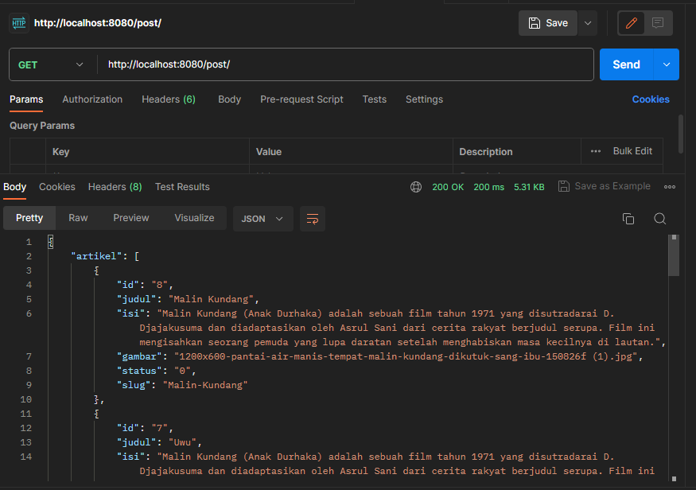
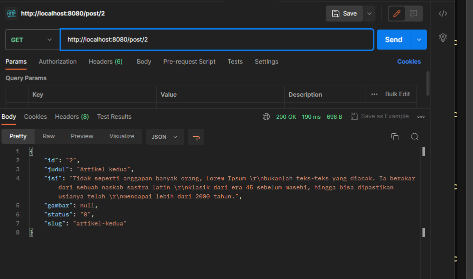
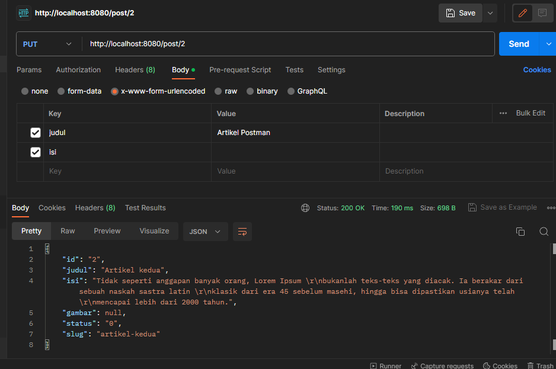
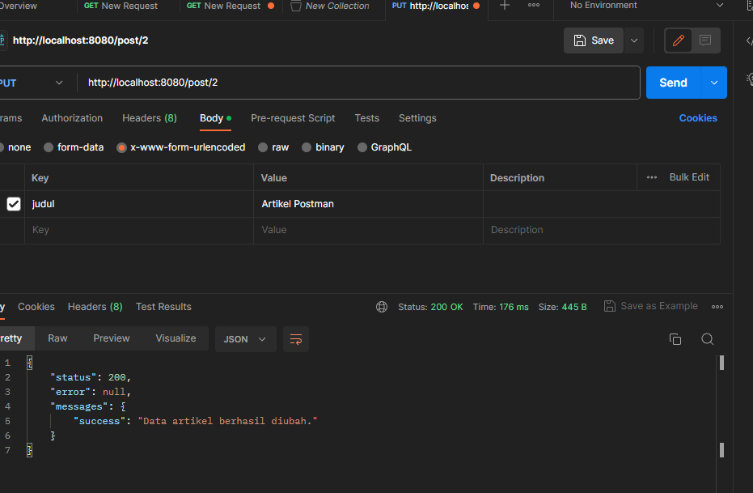
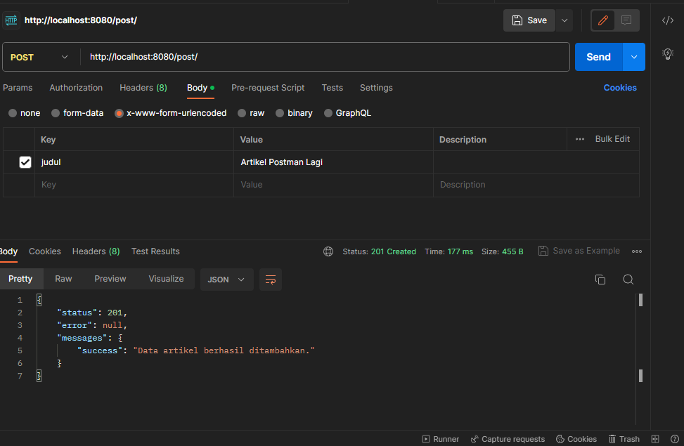
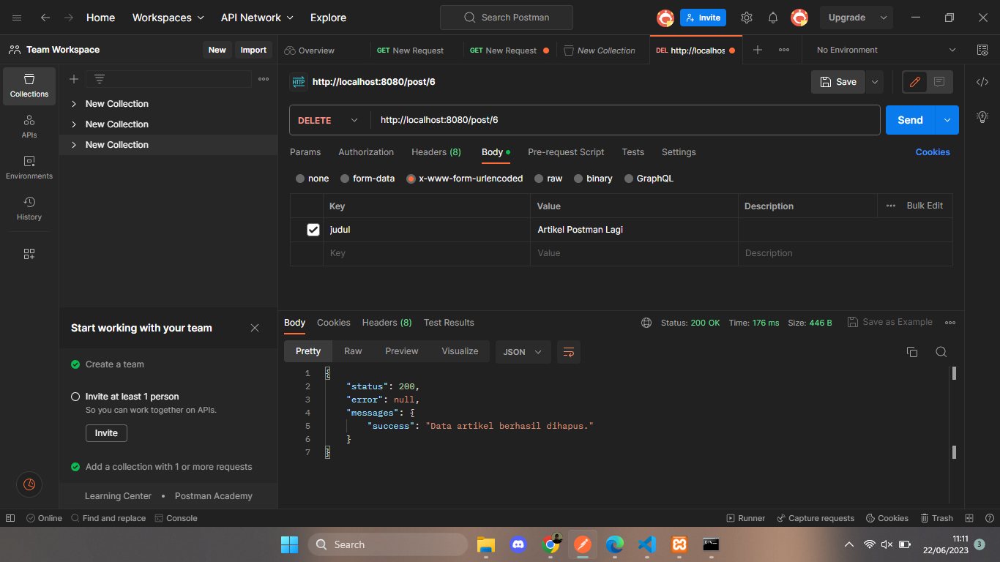

# Lab7Web-API

# PHP-CodeIgniter

This project is an assignment from my class
#### NIM : 312110103
#### Kelas : TI.21.A2
#### MatKul : Pemrograman Web 2

# Penggunaan PostMan
### Penggunaan Fungsi GET

### Penggunaan Fungsi GET Berdasarkan ID

### Penggunaan Fungsi PUT

### Penggunaan Fungsi PUT data berhasil di ubah

### Penggunaan Fungsi POST data berhasil di tambahkan

### Penggunaan Fungsi DELETE data berhasil di hapus

